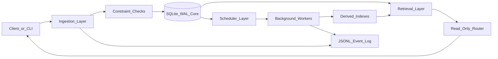

# earth-database

**One line:** A local embedded memory system that separates ingestion, storage, retrieval, routing, scheduling, provenance, constraints, and observability into inspectable layers.

## Status

- **Maturity:** experimental scaffold
- **Production use:** no; this is a low-latency local architecture prototype

## What This Is

`earth-database` is a small memory substrate for systems that need predictable local reads and writes before they need distributed services. It uses SQLite in WAL mode as the source of truth, FTS5 for exact/provenance-first retrieval, JSONL event logs for observability, and an explicit scheduler table for slow background work.

The design keeps the hot path narrow:

1. Validate input and constraints.
2. Hash content and capture provenance.
3. Write canonical memory rows in SQLite.
4. Update local FTS.
5. Enqueue derived work for later.

Embeddings, summaries, compaction, vector indexes, and policy learning are slow-path jobs. They can improve retrieval later, but they do not own the canonical record.

## What This Is Not

- Not a cloud memory platform.
- Not a finished assistant.
- Not a vector-first RAG stack.
- Not a benchmarked production database.
- Not a replacement for `memory-dropbox`; this is a lower-latency embedded sibling.

## Quickstart

```bash
python -m venv .venv
. .venv/bin/activate
pip install -e .
python -m pytest
python -m earth_database demo
```

The demo creates a local SQLite database and JSONL trace under a temporary directory, ingests one record, retrieves it through FTS, and prints queued background jobs.

## Architecture At A Glance



## Layer Boundaries

- `ingestion.py` validates and writes canonical memory without doing slow enrichment.
- `storage.py` owns SQLite schema, WAL setup, transactions, canonical rows, FTS, provenance, events, and jobs.
- `retrieval.py` performs exact/provenance-first lookup with optional FTS ranking.
- `routing.py` selects retrieval strategy from query shape and constraints without mutating storage.
- `scheduler.py` enqueues, claims, completes, and fails idempotent background jobs.
- `provenance.py` captures hashes, source lineage, and runtime provenance.
- `observability.py` writes typed JSONL events.
- `constraints.py` centralizes explicit limits and allowed operations.

## Low-Latency Posture

The first implementation assumes one local process or a small set of local tools sharing one SQLite file. SQLite runs in WAL mode, retrieval uses indexed tables and FTS5, and background jobs are explicit records that can be processed by a worker later.

Latency-sensitive code should not compute embeddings, call LLMs, compact history, or update learned routing weights. Those jobs are scheduled and observable.

## Verification

```bash
PYTHONPATH=src python3 -m unittest discover -s tests
python -m earth_database --help
```

If you install dev tooling, the same tests are also pytest-compatible.

## License

MIT, unless this folder is moved into a repository with a different declared license.
# earth-database
