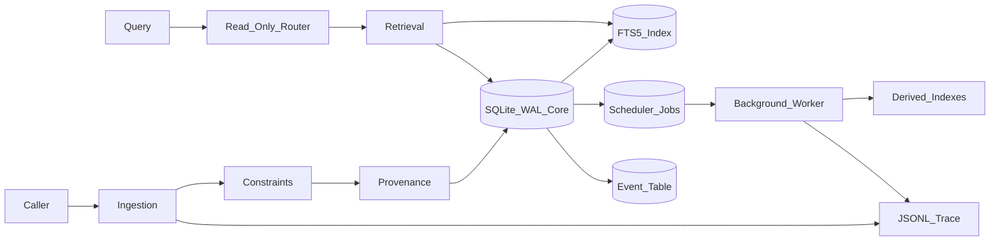

# Architecture

`earth-database` is a local embedded memory system optimized for low-latency exact and provenance-aware access. It separates the memory loop into observable layers so slow derived work can evolve without contaminating the canonical record.

## Design Goals

- **Low latency first:** the hot path is SQLite plus local file append only.
- **Layer separation:** ingestion, storage, retrieval, routing, scheduling, provenance, constraints, and observability each have a narrow contract.
- **Source of truth clarity:** canonical content, events, provenance, and jobs live in SQLite.
- **Derived index humility:** semantic/vector indexes are optional slow-path artifacts.
- **Inspectability:** every meaningful transition can emit a JSONL event.

## Data Flow

1. A caller submits text plus source metadata to the ingestion layer.
2. Constraints validate content size, source type, tags, metadata, and requested jobs.
3. Provenance computes hashes and captures source/runtime context.
4. Storage writes the item, event, provenance row, FTS row, and scheduled jobs in one SQLite transaction.
5. Observability appends JSONL events for capture and scheduling.
6. Retrieval uses exact filters and FTS to return canonical rows with provenance.
7. Routing chooses retrieval strategy from query shape without mutating memory.
8. Scheduler workers later claim due jobs for embeddings, summaries, compaction, or reindexing.

## Layer Contracts

### Ingestion

Ingestion is a thin command handler. It may validate, hash, persist, emit events, and enqueue jobs. It must not compute embeddings, call external models, summarize content, or update routing policy.

### Storage

Storage owns schema and transactionality. It enables WAL mode, creates normalized tables, writes canonical records, updates FTS, and exposes narrow repository-style methods.

### Retrieval

Retrieval is exact/provenance-first. It supports item ID lookup, tag filters, source filters, content-hash filters, and FTS queries. Semantic retrieval can be added later as a derived route.

### Routing

Routing is a pure/read-only decision layer. Given query text and constraints, it returns a route plan such as `by_id`, `by_hash`, `tag_filter`, `fts`, or `list_recent`. The router does not write events or mutate storage.

### Scheduling

The scheduler stores background work in SQLite with idempotency keys, due timestamps, attempts, and errors. Workers claim jobs explicitly and write outcomes back through storage.

### Provenance

Provenance preserves source URI, source type, content hash, optional parent hash, timestamps, runtime details, and the event ID that introduced the item.

### Observability

Observability writes append-only JSONL records. These are intentionally separate from SQLite events so operators can inspect traces even if a later process opens the database with a separate tool.

## Hot Path Invariants

- One ingestion command creates one canonical item event.
- A content hash is computed before storage.
- FTS is updated in the same transaction as the item.
- Background jobs are scheduled but not executed in ingestion.
- Routing cannot mutate storage.
- Derived records must point back to original event IDs and content hashes.

## SQLite Tables

- `items`: canonical memory content and metadata.
- `item_tags`: normalized tags for exact filtering.
- `events`: typed storage events.
- `provenance`: lineage and hash metadata.
- `jobs`: idempotent background work.
- `items_fts`: local FTS5 index over item content.

## Scale Posture

This version prioritizes single-node latency and debuggability. If a future version needs multi-process writes or network serving, keep SQLite as the embedded core and add a service wrapper rather than moving slow work into ingestion.
